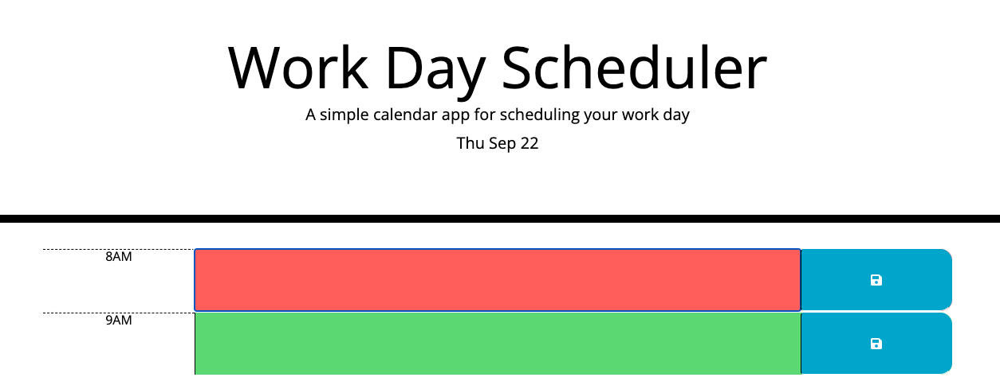

# Day-Tracker

## Description

Work Day Scheduler allows a user to save events for each hour of the day

## Table of Contents

If your README is long, add a table of contents to make it easy for users to find what they need.

- [Installation](#installation)
- [Usage](#usage)
- [Credits](#credits)
- [License](#license)

## Installation

Down Load enjoy 

## Usage

simple calendar application that allows a user to save events for each hour of the day!
 Site: https://frozzel.github.io/Day-Tracker/

    
 

## Credits

Dennis Hickox      (https://github.com/frozzel)

 Dev Mozillia     (https://developer.mozilla.org/en-US/docs/Web/JavaScript/Reference/Global_Objects/Date)

                  (https://developer.mozilla.org/en-US/docs/Web/JavaScript/Reference/Global_Objects/Date/toLocaleTimeString)

Stack Over Flow       ( https://stackoverflow.com/questions/40791207/setting-and-getting-localstorage-with-jquery )

                   (https://stackoverflow.com/questions/23979993/change-the-button-icon-from-bootstrap-is-not-working)

 Plus2net         (https://www.plus2net.com/jquery/event-click.php)

 Angularswiki (icon for floppy)       ( https://www.angularjswiki.com/fontawesome/fa-save/)

 Bootstrap        (https://getbootstrap.com/docs/4.0/getting-started/introduction/)

Starter Code      (https://github.com/coding-boot-camp/super-disco)

## License

MIT  YOu Can Do What Ever yOu lIkE ;)

